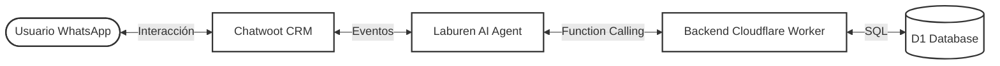
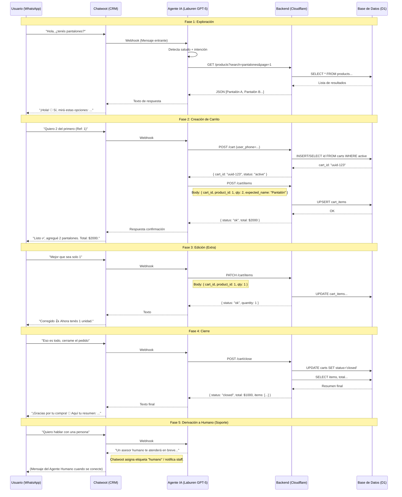

# Diseño Conceptual del Agente de IA - Laburen Challenge

## 1. Arquitectura del Sistema
El sistema opera mediante una orquestación de 4 capas específicas:
1.  **Interfaz:** WhatsApp (Chip Tuenti Prepago: `+54 9 11 7827-7213`).
2.  **CRM:** Chatwoot (gestiona la sesión, historial y derivación humana).
3.  **Cerebro:** Laburen Dashboard (Modelo **GPT-5-Chat** orquestando tools).
4.  **Backend (MCP):** Cloudflare Worker + D1 Database (Lógica de negocio y persistencia).

### Diagrama de Arquitectura

## 2. Flujo de Interacción (Diagrama de Secuencia)
Este diagrama ilustra el viaje del usuario desde la exploración hasta el cierre de la compra.

## 3. Especificación de Endpoints (MCP)
El **Model Context Protocol (MCP)** expone las siguientes capacidades al Agente:

### Exploración
*   **`GET /products`**
    *   **Params:** `search` (string), `page` (int), `limit` (int).
    *   **Función:** Busca productos por nombre/categoría. Soporta paginación para catálogos grandes.
    *   **Retorno:** Lista de productos con ID, nombre, precio, stock y descripción.

### Gestión del Carrito
*   **`POST /cart`**
    *   **Body:** `{ user_phone }`
    *   **Función:** (Idempotente) Crea un nuevo carrito o recupera el activo si el usuario ya tiene uno abierto.
    *   **Retorno:** `cart_id` (UUID).

*   **`GET /cart`**
    *   **Params:** `id` (UUID)
    *   **Función:** Lista el contenido actual del carrito y el subtotal.

*   **`POST /cart/close`**
    *   **Query/Body:** `cart_id`
    *   **Función:** Finaliza la compra, marca el carrito como cerrado y genera el ticket final.

### Gestión de Items
*   **`POST /cart/items`** (Agregar)
    *   **Body:** `{ cart_id, product_id, quantity, expected_name }`
    *   **Función:** Agrega items. Incluye validación de seguridad (`expected_name`) para evitar alucinaciones de IDs.

*   **`PATCH /cart/items`** (Editar)
    *   **Body:** `{ cart_id, product_id, quantity, expected_name }`
    *   **Función:** Ajusta cantidades exactas. También valida nombre por seguridad.

*   **`DELETE /cart/items`** (Eliminar)
    *   **Query:** `cart_id`, `product_id`
    *   **Función:** Elimina un producto específico del carrito.
